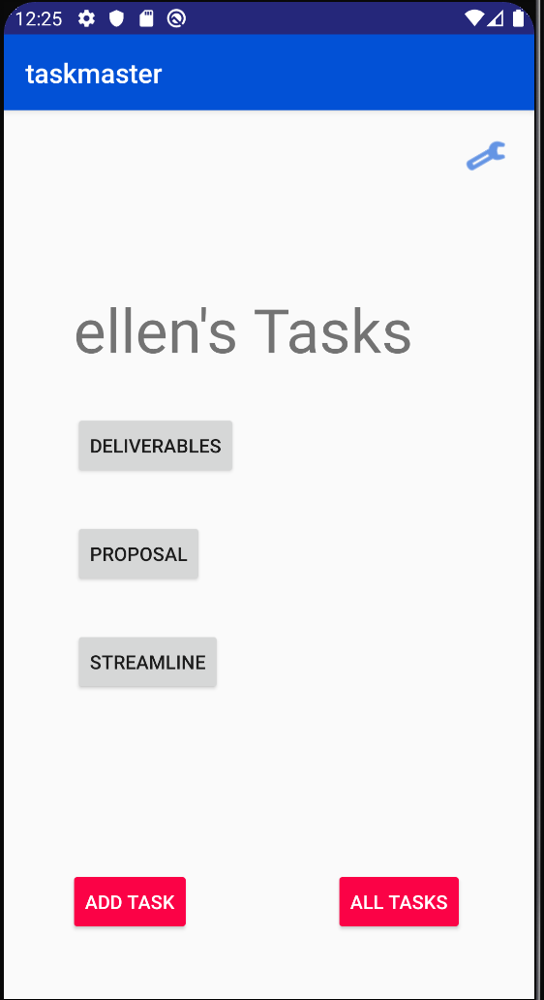

# taskmaster

## 2/11/2020
- [X] Homepage
    - [X] heading at the top of the page, 
    - [X] an image to mock the “my tasks” view
    - [ ] buttons at the bottom of the page to allow going to the “add tasks” and “all tasks” page

- [X] Add a Task
    - [X] allow users to type in details about a new task, specifically a title and a body
    - [x] when users click the “submit” button, show a “submitted!” label on the page

- [X] All Tasks
    - [X] the all tasks page should just be an image with a back button

## 2/10/2020
- [X] App
    - [X] custom color scheme
- [X] Homepage
    - [X] buttons at the bottom of the page to allow going to the “add tasks” and “all tasks” page
    - [X] main page contains three different buttons with hardcoded task titles that link to the Task Detail page, where the title matches the text from the button clicked on the prevous page.
    - [X] button to visit the Settings page, and once the user has entered their username, it should display “{username}’s tasks” above the three task buttons
- [X] Task Detail
    - [X] Task Detail page with title at the top of the page and Lorem Ipsum description.
- [X] Settings
    - [X] Settings page that allows users to enter a username and hit save.
