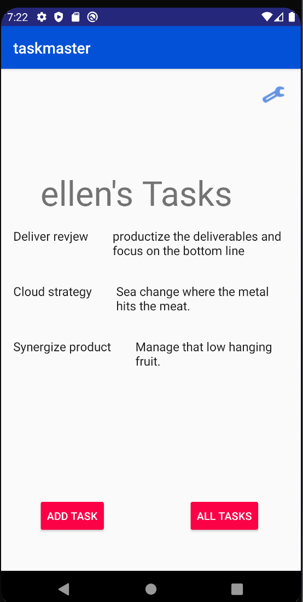

# taskmaster

Android app that allows user to keep track of tasks.

## 2/13/2020
- [X] Task Model
    - [X] Task class with title, a body, and a state(“new”, “assigned”, “in progress”, or “complete”)

- [X] Homepage
    - [X] homepage uses a RecyclerView for displaying hard coded Task data
    - [X] ability to tap on any one of the Tasks in the RecyclerView, launches the detail page with the correct Task title/body.

## 2/12/2020
- [X] Homepage
    - [X] heading at the top of the page, 
    - [X] an image to mock the “my tasks” view
    - [X] buttons at the bottom of the page to allow going to the “add tasks” and “all tasks” page

- [X] Add a Task
    - [X] allow users to type in details about a new task, specifically a title and a body
    - [x] when users click the “submit” button, show a “submitted!” label on the page

- [X] All Tasks
    - [X] the all tasks page should just be an image with a back button

## 2/11/2020
- [X] App
    - [X] custom color scheme
- [X] Homepage
    - [X] buttons at the bottom of the page to allow going to the “add tasks” and “all tasks” page
    - [X] main page contains three different buttons with hardcoded task titles that link to the Task Detail page, where the title matches the text from the button clicked on the prevous page.
    - [X] button to visit the Settings page, and once the user has entered their username, it should display “{username}’s tasks” above the three task buttons
- [X] Task Detail
    - [X] Task Detail page with title at the top of the page and Lorem Ipsum description.
- [X] Settings
    - [X] Settings page that allows users to enter a username and hit save.
## 2/26/2020
- [X] Tasks Are Cloudy
    - [X] Using the amplify add api command, created a Task resource that replicates existing Task schema
- [X] Add Task Form
    - [X] modified Add Task form to save the data entered in as a Task to DynamoDB.
    - [X] modified Add Task form to include a teams spinner
- [X] Homepage
    - [X] refactored your homepage’s RecyclerView to display all Task entities in DynamoDB.
- [X] Tasks Are Owned By Teams
    - [X] second entity for a team, which has a name and a list of tasks
    - [X] updated tasks to be owned by a team
    - [X] hardcoded three teams by running a mutation three times
    
## 2/26/2020
- [X] Settings
    - [X] ability for user choose their team on the Settings page
- [X] Homepage
    - [X] only tasks associate with user-select team display on homepage
    
